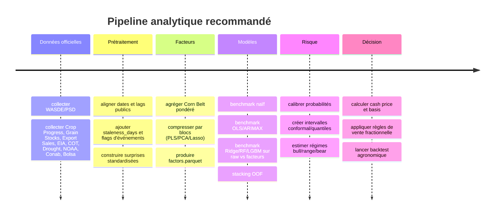

# Étude professionnelle des déterminants et de la prévision du maïs CBOT

## Résumé exécutif

Le prix du maïs coté au Chicago Board of Trade n’est ni un simple prix “technique” ni un pur prix “macro”. C’est un prix d’équilibre entre un bilan offre‑demande mondial, une météo très localisée sur le Corn Belt, une demande énergétique fortement liée à l’éthanol, une compétitivité export qui dépend du dollar et de l’Amérique du Sud, et une couche de positionnement spéculatif qui module la vitesse et l’amplitude des mouvements. Le marché des futures maïs est en outre extrêmement liquide et actif, ce qui veut dire que beaucoup d’information est déjà intégrée rapidement dans les prix. La bonne réponse méthodologique n’est donc pas d’empiler des centaines de colonnes, mais de condenser les sources d’information en facteurs économiques bien définis, régimes de marché, probabilités calibrées et intervalles robustes. citeturn5search4turn1search1turn12search7turn16search12turn16search0

Pour les horizons J+5 et J+10, les moteurs à privilégier sont les variables qui mettent à jour les anticipations à haute fréquence : surprises de rapports, structure de courbe, COT, export sales/inspections, production et stocks d’éthanol, base locale et export basis. Pour J+20 et J+30, la hiérarchie bascule vers les variables qui modifient réellement le bilan physique : stocks‑to‑use, rythme de dégradation ou d’amélioration des conditions culturales, stress hydrique/thermique pondéré par production, progression des semis/récoltes, signaux Brésil/Argentine/Ukraine, et compétitivité internationale. Les fréquences officielles confirment cette lecture : WASDE est mensuel, Crop Progress est hebdomadaire, Grain Stocks est trimestriel, Export Sales est hebdomadaire, le COT est hebdomadaire mais publié avec un décalage mardi→vendredi, l’EIA diffuse l’éthanol chaque semaine, et le U.S. Drought Monitor chaque jeudi. citeturn0search8turn0search5turn2search13turn13search13turn13search18turn13search0turn13search2turn0search6turn1search14

Le cadre économétrique recommandé doit donc rester lisible : un noyau fondamental basé sur le ratio stocks‑to‑use, la météo agrégée du Corn Belt, les exportations, l’éthanol et le dollar, complété par une couche ML pour capter les non‑linéarités et les interactions. La littérature USDA sur la détermination du prix du maïs souligne explicitement qu’une formulation en stocks‑to‑use constitue un noyau pertinent de modélisation, augmenté par des variables de politique et de marché ; l’ERS rappelle aussi que des stocks‑to‑use historiquement bas augmentent la volatilité potentielle. citeturn16search12turn16search0

La meilleure architecture pour ta V2 n’est pas “189 features → 50 modèles”, mais “8 à 10 blocs → 20 à 40 facteurs synthétiques → modèles benchmarkés en walk‑forward → calibration probabilité/intervalle → moteur de décision agriculteur en cash price”. Pour réduire proprement la dimension, il faut combiner agrégation experte, pondération Corn Belt, PCA/PCR pour le diagnostic, PLS pour les blocs où la cible est corrélée à des directions de faible variance, et Lasso pour forcer la parcimonie. Pour les probabilités, la calibration post‑hoc par sigmoid/Platt ou isotonic est standard ; pour les intervalles, le split conformal ou cross‑conformal apporte une couverture contrôlée avec des modèles arbitraires. citeturn7search11turn7search3turn7search7turn20search4turn7search0turn7search4turn7search14turn7search6

Enfin, l’indicateur agriculteur ne doit jamais raisonner uniquement sur le future CBOT. Il doit raisonner sur le **cash price local**, donc future + basis locale, car la basis reflète précisément l’offre/demande locale, les coûts de transport et la disponibilité de stockage. C’est ce niveau‑là qui conditionne réellement la décision “vendre maintenant / stocker / vendre par paliers”, avec coûts de stockage et contraintes de trésorerie. citeturn2search11turn11search13turn11search0

## Cadre de recherche et noyau de sources officielles

La stratégie ci‑dessous prolonge ta refonte V2 déjà cadrée dans l’audit initial, en conservant la logique “variables d’abord, indicateur agriculteur ensuite, plateforme générique en dernier”. fileciteturn0file0

La base de données officielle à privilégier doit être organisée autour de portails publiés par l’entity["organization","USDA","United States Department of Agriculture"], l’entity["organization","EIA","U.S. Energy Information Administration"], la entity["organization","CFTC","U.S. Commodity Futures Trading Commission"], la entity["organization","NOAA","National Oceanic and Atmospheric Administration"], le portail entity["organization","Drought.gov","U.S. Drought Portal"], la entity["organization","FAO","Food and Agriculture Organization"], ainsi que les organismes officiels sud‑américains quand on sort des États‑Unis. Les jeux de données mondiaux de la FAO disposent en plus d’une interface française, ce qui est utile pour la documentation métier même si la majorité des APIs agricoles restent en anglais. citeturn18search13turn18search1turn4search4turn4search11turn4search6

| Bloc | Portails officiels prioritaires | Fréquence | Lag public à encoder |
|---|---|---|---|
| Offre/demande US & monde | urlWASDEturn0search8 ; urlPSD Onlineturn4search3 ; urlWorld Agricultural Productionturn4search16 | mensuel | J0 + `staleness_days` |
| Conditions culturales US | urlCrop Progress & Conditionturn0search5 ; urlCharts & 5-year averagesturn0search13 ; urlQuick Statsturn2search0 | hebdomadaire / quotidien selon séries | 1–4 jours |
| Rapports de stocks et surfaces | urlGrain Stocksturn2search1 ; urlProspective Plantingsturn2search6 | trimestriel / annuel | événementiel |
| Demande éthanol et énergie | urlWeekly Ethanol Productionturn0search6 ; urlFuel Ethanol Stocksturn0search2 ; urlWeekly Gasoline Product Suppliedturn12search1 ; urlRenewable Fuel Annual Standardsturn12search4 | hebdomadaire / annuel | 0–7 jours |
| Exports et inspections | urlExport Sales Reporting Programturn13search13 ; urlESRQSturn13search18 ; urlGrains Inspected for Exportturn5search3 | hebdomadaire | jeudi matin ET ; mardi/vendredi selon publication |
| Positionnement et microstructure “macro” | urlCOT Reportsturn13search0 ; urlCOT Release Scheduleturn13search2 ; urlDisaggregated COT Notesturn0search7 ; urlCorn Open Interest & CVOLturn5search0 | hebdomadaire / quotidien | mardi→vendredi pour COT |
| Base locale, transport, export basis | urlGrain Basisturn2search11 ; urlState Grain Reportsturn2search3 ; urlGrain Transportation datasetsturn5search6 ; urlFGIS Data & Statisticsturn5search11 | quotidien / hebdomadaire | 0–7 jours |
| Météo et sécheresse | urlNOAA Climate Data Onlineturn9search1 ; urlU.S. Crops and Livestock in Droughtturn1search2 ; urlU.S. Drought Monitorturn1search14 ; urlONI ENSOturn1search7 | quotidien / hebdomadaire / mensuel | 0–7 jours |
| Remote sensing | urlNASA SMAPturn9search14 ; urlNASA NDVIturn9search7 | 2–3 jours / périodique | faible |
| Hors États‑Unis | urlConab Safra de Grãosturn4search4 ; urlConab Progresso de Safraturn4search11 ; urlBolsa de Cerealesturn4search6 ; urlFAO Bulletin céréales FRturn18search13 | hebdomadaire / mensuel | variable |

Pour la construction de lags métier, les informations les plus sensibles à encoder correctement sont les suivantes : le COT reflète les positions du mardi et sort le vendredi à 15h30 ET ; l’Export Sales report est publié le jeudi à 8h30 ET ; le rapport hebdomadaire couvre la période vendredi→jeudi ; le WASDE est mensuel et la base PSD est mise à jour le jour de sa publication ; le U.S. Drought Monitor est mis à jour le jeudi ; Crop Progress est hebdomadaire durant la campagne et mensuel l’hiver. Sans ce calendrier, toute modélisation “daily” mélange vraies nouveautés et forward‑fill silencieux. citeturn13search0turn13search2turn13search13turn13search18turn0search8turn4search10turn1search14turn0search1turn0search5

## Architecture des facteurs synthétiques

Le cœur de l’étude doit être un fichier `factors.parquet` de **33 à 36 facteurs** maximum, structurés par blocs économiques et traçables jusqu’aux variables brutes. Le principe n’est pas d’écraser l’information, mais de la rendre **économiquement lisible**, **statistiquement stable** et **robuste au walk‑forward**. Ce choix est cohérent avec le fait que le prix du maïs s’explique d’abord par le bilan physique et les chocs de disponibilité/demande, tandis que les indicateurs de marché servent surtout à capter la vitesse d’ajustement, la convexité et le positionnement. La littérature USDA sur le prix du maïs justifie explicitement un noyau stocks‑to‑use ; les données météo et de végétation sont naturellement condensables en anomalies pondérées, et les méthodes PLS/Lasso sont adaptées aux blocs très colinéaires. citeturn16search12turn16search0turn9search7turn9search14turn7search11turn20search4

### Liste cible des facteurs synthétiques

| Bloc | Facteurs recommandés | Nb cible |
|---|---|---:|
| Offre/demande US | `us_stu`, `us_supply_minus_use_z`, `us_area_yield_pressure`, `grainstocks_on_off_farm_gap` | 4 |
| Offre/demande monde | `world_stu`, `world_prod_gap`, `world_export_gap`, `south_america_balance_proxy` | 4 |
| Météo Corn Belt | `belt_temp_anom_14d`, `belt_prcp_anom_14d`, `belt_heat_stress_10d`, `belt_drought_d1plus`, `belt_soil_moisture_z`, `belt_ndvi_z` | 6 |
| Crop progress | `planting_progress_gap`, `crop_condition_gap`, `harvest_progress_gap` | 3 |
| Demande éthanol | `ethanol_prod_z`, `ethanol_stock_days`, `gasoline_supplied_4w_z`, `ethanol_margin_proxy` | 4 |
| Export / compétitivité | `export_sales_surprise_z`, `export_shipments_vs5y_z`, `export_inspections_vs5y_z`, `competitiveness_us_vs_brazil_z` | 4 |
| Macro / FX / coûts | `dxy_z`, `usd_brl_z`, `real_rate_z`, `natgas_fertilizer_ratio_z` | 4 |
| CFTC / participation | `managed_money_net_z`, `producer_net_z`, `open_interest_change_z`, `crowding_extreme_score` | 4 |
| Structure futures | `spread_1_2_z`, `spread_1_3_z`, `basis_local_z`, `corn_cvol_z` | 4 |
| Saisonnalité / calendrier | `doy_fourier_1`, `doy_fourier_2`, `days_to_usda_event_z` | 3 |
| Surprises WASDE / USDA | `wasde_yield_surprise_z`, `wasde_stocks_surprise_z`, `wasde_exports_surprise_z`, `usda_event_shock_score` | 4 |

Cette table ne doit pas être interprétée comme “36 colonnes fixes coûte que coûte”, mais comme une **cible de complexité**. Un bon résultat sera atteint si chaque facteur a une justification agronomique ou de marché, un mapping explicite vers des variables brutes, une date de disponibilité publique, et un comportement stable en walk‑forward. citeturn17search0turn7search7turn7search3turn20search4

### Règles de construction incontournables

Le **Corn Belt** doit être agrégé par poids de production ou de surface, pas par simple moyenne d’États. La formule recommandée est :

\[
z_{s,t}^{(\text{météo})}=\frac{x_{s,t}-\mu_{s,\text{doy}(t)}}{\sigma_{s,\text{doy}(t)}} \qquad
\text{belt\_x}_t=\sum_s w_s z_{s,t}^{(\text{météo})}
\]

avec \(w_s = \frac{\text{area\_planted}_s}{\sum_s \text{area\_planted}_s}\) ou \(w_s = \frac{\text{production}_s}{\sum_s \text{production}_s}\). Les climatologies et anomalies peuvent être construites à partir des données journalières NOAA/NCEI, tandis que la végétation et l’humidité de surface peuvent être captées via NDVI et SMAP. citeturn9search1turn9search13turn9search7turn9search14

Les **surprises** doivent être standardisées et séparées du niveau absolu. La hiérarchie recommandée est :

\[
\text{surprise\_consensus}_t=\frac{x_t-\mathbb{E}_t[x_t]}{\sigma(\varepsilon)}
\]

si un consensus analyste fiable existe ; sinon, créer trois variantes robustes :

\[
\text{surprise\_prev}_t = x_t-x_{t-1},
\quad
\text{surprise\_5y}_t = x_t-\overline{x}_{t,5y},
\quad
\text{surprise\_trend}_t = x_t-\hat{x}_{t|t-1}
\]

avec \(\hat{x}_{t|t-1}\) estimé **uniquement** sur l’historique disponible avant la publication. C’est particulièrement important pour WASDE, Grain Stocks, Prospective Plantings, Crop Progress et Export Sales. citeturn0search8turn2search1turn2search6turn13search13turn0search13

Les variables de fréquence lente doivent conserver un compteur de **staleness**. Au lieu de forward‑fill silencieusement `world_stu`, il faut publier deux colonnes : la valeur elle‑même et `world_stu_staleness_days`. Cela permet au modèle de distinguer “information fraîche” et “information ancienne”. Cette règle est particulièrement utile pour WASDE, Grain Stocks, Prospective Plantings, ONI et certaines statistiques monde. citeturn0search8turn2search13turn2search6turn1search7

### Réduction de dimension recommandée

La réduction doit être **hybride**. PCA sert au diagnostic non supervisé et à la compression de blocs très redondants ; PLS est préférable lorsque la direction utile pour prédire \(y\) n’est pas la direction de variance maximale ; Lasso sert à éliminer proprement les variables résiduelles et à imposer la parcimonie. En pratique, il faut faire : agrégation experte → standardisation fold‑wise → PLS/PCA par bloc → LassoCV final sur facteurs candidats. citeturn7search7turn7search11turn7search3turn20search4turn20search0

### Snippet Python pour construire `factors.parquet`

```python
from __future__ import annotations
import numpy as np
import pandas as pd
from sklearn.preprocessing import StandardScaler
from sklearn.cross_decomposition import PLSRegression
from sklearn.linear_model import LassoCV

FEATURES = "data/processed/features.parquet"
TARGETS = "data/processed/targets.parquet"
OUT = "data/processed/factors.parquet"

BLOCKS = {
    "supply_demand_us": [
        "wasde_stocks_to_use_calc_z",
        "wasde_supply_minus_use_z",
        "area_planted_total",
        "yield_weighted",
        "stocks_mar", "stocks_jun", "stocks_sep", "stocks_dec",
    ],
    "weather_belt": [
        "wx_belt_tavg_c_anom_z",
        "wx_belt_prcp_mm_anom_z",
        "wx_belt_heat_days",
        "wx_belt_drought_d1_plus",
        "wx_belt_soil_moisture_z",
        "wx_belt_ndvi_z",
    ],
    "ethanol": [
        "ethanol_production_weekly",
        "ethanol_stocks_weekly",
        "gasoline_demand_4w",
        "ethanol_margin_proxy",
    ],
    "exports": [
        "corn_export_sales_weekly",
        "corn_export_shipments_weekly",
        "corn_export_inspections_weekly",
        "us_corn_vs_brazil_corn_spread",
    ],
    "macro_fx": [
        "dxy", "usd_brl", "real_fed_rate", "natural_gas_price"
    ],
    "cftc": [
        "managed_money_net", "producer_merchant_net", "open_interest"
    ],
    "futures_structure": [
        "corn_spread_1_2", "corn_spread_1_3", "basis_proxy", "corn_cvol"
    ],
    "crop_progress": [
        "corn_planted_pct_vs_5y_avg",
        "corn_good_excellent_pct_vs_5y_avg",
        "corn_harvested_pct_vs_5y_avg",
    ],
    "wasde_surprises": [
        "wasde_yield_surprise_vs_prev",
        "wasde_ending_stocks_surprise_vs_prev",
        "wasde_exports_surprise_vs_prev",
        "wasde_world_stocks_surprise_vs_prev",
    ],
}

def build_block_factor(X_block: pd.DataFrame, y: pd.Series, max_components: int = 2) -> pd.DataFrame:
    cols = [c for c in X_block.columns if c in X_block.columns]
    Xb = X_block[cols].copy()
    Xb = Xb.replace([np.inf, -np.inf], np.nan)
    Xb = Xb.ffill().bfill()
    scaler = StandardScaler()
    Xs = scaler.fit_transform(Xb)

    if Xb.shape[1] == 1:
        return pd.DataFrame({f"{cols[0]}_factor": Xs[:, 0]}, index=X_block.index)

    n_comp = min(max_components, Xb.shape[1], 2)
    pls = PLSRegression(n_components=n_comp, scale=False)
    pls.fit(Xs, y.values)
    Z = pls.transform(Xs)

    out = {}
    for k in range(Z.shape[1]):
        out[f"{X_block.attrs.get('block_name', 'block')}_pls{k+1}"] = Z[:, k]
    return pd.DataFrame(out, index=X_block.index)

X = pd.read_parquet(FEATURES).set_index("Date")
Y = pd.read_parquet(TARGETS).set_index("Date")
y = Y["y_logret_h20"].dropna()
X = X.loc[y.index]

factors = pd.DataFrame(index=X.index)
for block, cols in BLOCKS.items():
    existing = [c for c in cols if c in X.columns]
    if not existing:
        continue
    X_block = X[existing].copy()
    X_block.attrs["block_name"] = block
    Z = build_block_factor(X_block, y)
    factors = factors.join(Z, how="left")

# sélection parcimonieuse finale
tmp = factors.replace([np.inf, -np.inf], np.nan).ffill().bfill()
lasso = LassoCV(cv=5, random_state=42, n_jobs=-1)
lasso.fit(tmp, y)
keep = tmp.columns[np.abs(lasso.coef_) > 1e-8]
factors = factors[keep].reset_index().rename(columns={"index": "Date"})
factors.to_parquet(OUT, index=False)
print("saved:", OUT, factors.shape)
```

## Contribution des blocs par horizon et par régime

La hiérarchie des blocs n’est pas fixe dans le temps. Elle dépend à la fois de l’horizon et du régime. Mais il existe une **priorité économique plausible** avant même de lancer les modèles : les variables événementielles et de positionnement dominent souvent le très court terme ; les variables de bilan et de culture dominent davantage à trois ou quatre semaines ; la basis et la structure de courbe donnent une information très utile sur la réalité physique locale ; enfin les régimes serrés en stocks rendent le marché plus sensible à la météo. Cette lecture est cohérente avec les calendriers de publication officiels, l’importance du stocks‑to‑use mise en avant par l’ERS, et le fait que la basis reflète les conditions régionales de demande, transport et stockage. citeturn13search18turn13search0turn16search12turn16search0turn2search11turn11search13

### Matrice de contribution attendue par horizon

Le tableau suivant doit être lu comme une **hypothèse de recherche à mesurer localement**, pas comme un résultat déjà estimé sur ta V2.

| Bloc | J+5 | J+10 | J+20 | J+30 | Commentaire économique |
|---|---|---|---|---|---|
| Surprises WASDE / USDA | Très élevé autour des dates de rapport | Élevé | Moyen | Moyen | chocs discrets, forte réaction immédiate |
| CFTC / open interest | Élevé | Élevé | Moyen | Faible à moyen | accélère, freine ou renverse les moves |
| Structure futures / basis | Élevé | Élevé | Moyen | Moyen | renseigne les tensions physiques et le carry |
| Exports / inspections / compétitivité | Élevé | Élevé | Moyen | Moyen | capte la demande externe et l’arbitrage avec le Brésil |
| Éthanol / énergie | Moyen à élevé | Élevé | Élevé | Élevé | demande domestique récurrente et sensible à l’énergie |
| Météo Corn Belt / Drought / NDVI | Moyen hors saison, très élevé en saison | Élevé | Très élevé en juin‑août | Très élevé en saison | driver direct du yield et des anticipations |
| Crop Progress / condition | Moyen | Élevé | Très élevé | Très élevé | signal intermédiaire entre météo et rendement |
| Offre/demande US & monde | Moyen | Moyen à élevé | Élevé | Très élevé | ancre le niveau de prix à moyen terme |
| Macro / dollar / taux / coûts | Moyen | Moyen | Moyen à élevé | Moyen à élevé | agit via compétitivité export et coûts d’intrants |
| Saisonnalité / calendrier | Moyen | Moyen | Moyen | Moyen | structure le timing des réactions |

### Régimes bull / range / bear

L’usage d’un modèle de Markov switching est adapté ici parce que `MarkovRegression` autorise des coefficients et une variance qui changent selon le régime. Sur le maïs, un triptyque simple fonctionne bien conceptuellement : **bull/tight**, **range/neutral**, **bear/ample**. Le modèle doit être estimé **uniquement** sur la fenêtre d’entraînement de chaque split pour éviter toute fuite. citeturn10search0turn10search2

| Régime | Signature économique | Blocs les plus informatifs | Conséquence pratique |
|---|---|---|---|
| Bull / tight stocks | stocks faibles, curve plus tendue, basis plus ferme, météo très price‑sensitive | météo, surprises, basis, CFTC crowding | privilégier le risque de rater la hausse |
| Range / neutral | stocks confortables, volatilité moyenne, peu de chocs | structure futures, exports, éthanol, saisonnalité | ventes graduelles et discipline de seuil |
| Bear / surplus | stocks élevés, concurrence Sud Amérique, dollar ferme | world balance, FX, exports, CFTC downside, macro | vendre plus tôt et réduire coût de portage |

### Comment mesurer proprement la contribution des blocs

La bonne pratique n’est pas de se contenter d’une feature importance brute. Il faut calculer, **par horizon** et **par régime** :

- le gain de performance incrémental quand on ajoute un bloc à un noyau de base ;
- une **group permutation importance** par bloc sur les ensembles de test walk‑forward ;
- pour les modèles linéaires, le \(\Delta R^2\) ou \(\Delta \text{MAE}\) bloc par bloc ;
- pour les modèles arbres, des **SHAP groupés** en sommant la contribution absolue des variables d’un même bloc ;
- des PDP/ICE uniquement sur les facteurs les plus stables et intuitifs, pas sur 150 variables brutes. Les documentations scikit‑learn et SHAP confirment que PDP/ICE servent à visualiser la réponse moyenne en fonction d’un sous‑ensemble de variables, tandis que le beeswarm SHAP résume densité, signe et intensité d’impact au niveau global. citeturn7search1turn7search13turn8search0turn8search2

## Modèles à comparer et protocole d’évaluation

La comparaison des modèles doit être orientée **benchmark**, pas “AutoML tous azimuts”. Il faut cinq familles bien distinctes : un naïf, un fondamental économétrique, un linéaire régularisé sur facteurs, un arbre/boosting sur features ou facteurs, et un stacking final. Statsmodels supporte bien ARIMA/SARIMAX avec exogènes et MarkovRegression pour les régimes ; scikit‑learn couvre calibration, PLS, Lasso et TimeSeriesSplit ; LightGBM couvre efficacement la régression et la classification tabulaire, mais ses probabilités ne doivent pas être utilisées sans calibration sérieuse. citeturn10search1turn10search0turn17search0turn7search0turn19search1turn8search1

### Portefeuille minimum de modèles

| Famille | Version recommandée | Inputs | Rôle principal | Interprétabilité |
|---|---|---|---|---|
| Naïf | `y_pred=0`, rolling mean, seasonal/event naive | aucun ou très peu | étage zéro | Très forte |
| Fondamental économétrique | OLS + Newey‑West ; ARIMAX/SARIMAX sur `us_stu + weather + ethanol + exports + dxy` | facteurs | niveau moyen et causalité lisible | Très forte |
| Linéaire parcimonieux | Ridge / ElasticNet / Lasso / PLSRegression | facteurs | robustesse, stabilité, blocs | Forte |
| ML tabulaire | RandomForest, LightGBM | features brutes ET facteurs | non‑linéarités/interactions | Moyenne |
| Méta‑modèle | Ridge ou LightGBM sur prédictions OOF | prédictions modèles + régime + incertitude | synthèse finale | Moyenne |

### Lecture attendue par horizon

| Horizon | Modèle qui devrait être très compétitif | Pourquoi | Principal risque |
|---|---|---|---|
| J+5 | LGBM raw, structure futures, export/ethanol, COT | capte signaux hebdo et non‑linéarités | overfit, mauvaise calibration |
| J+10 | Ridge/PLS facteurs + LGBM | transition entre flow et fondamentaux | confusion entre saison et vraie info |
| J+20 | ARIMAX fondamental + Ridge facteurs + stacking | météo/crop progress deviennent centraux | signaux monde encore incomplets |
| J+30 | facteurs fondamentaux + stacking | bilan physique et météo dominent davantage | faible signal sur return pointwise |

Ces classements doivent rester des **priors**, pas des conclusions. Le rapport final local devra présenter les vrais scores, par horizon, sur les sorties `y_logret_h*`, `y_up_h*`, `y_down_strong_h*` et `y_realized_vol_h*`.

### Walk‑forward, calibration et métriques

La validation doit être purement chronologique, avec fenêtre expanding ou rolling, test fixes, et **embargo = horizon** au minimum. Le principe de `TimeSeriesSplit` est précisément d’éviter d’apprendre sur le futur pour tester sur le passé. Dans ton cas, un splitter custom reste préférable, mais le principe statistique est le même. citeturn17search0turn17search4

Les métriques doivent être séparées par tâche :

- **Régression** : MAE, RMSE, MASE éventuel, corrélation rangs, erreur sur quantiles ;
- **Binaires** : ROC‑AUC, PR‑AUC, log loss, Brier score ;
- **Calibration** : Brier + calibration curve + pente/intercept de calibration ;
- **Intervalles** : couverture conformal à 80/90 %, largeur moyenne, sharpness ;
- **Décision agriculteur** : revenu par boisseau, downside CVaR ou max drawdown de revenu, pourcentage d’années battant les baselines.

Le Brier score est une règle propre stricte, mais scikit‑learn rappelle explicitement qu’il ne mesure pas à lui seul la calibration pure, car discrimination et calibration y contribuent à la fois. Il faut donc toujours le compléter par des courbes de calibration et, si possible, par un diagnostic calibration slope/intercept. citeturn17search1turn17search15turn7search12

Pour les classificateurs, la calibration post‑hoc recommandée est :

- `method="sigmoid"` si tu veux quelque chose de stable à petit échantillon ;
- `method="isotonic"` si l’échantillon OOF est assez large et que la non‑linéarité de calibration est marquée ;
- éventuellement temperature scaling pour multi‑classe, même si ton use case est surtout binaire/ordinal. Scikit‑learn documente ces options via `CalibratedClassifierCV`. citeturn7search0turn7search4turn7search12

Pour les intervalles, le plus robuste dans un pipeline multi‑modèles reste le conformal prediction “split” ou “cross‑conformal”, que des outils comme MAPIE implémentent de manière agnostique au modèle. L’avantage ici est décisif : tu peux mettre un intervalle valide au‑dessus d’un Ridge, d’un RandomForest ou d’un LightGBM sans devoir réécrire tout ton pipeline. citeturn7search6turn7search14turn7search22

### Snippet benchmark local

```python
from __future__ import annotations
import pandas as pd
import numpy as np
from sklearn.model_selection import TimeSeriesSplit
from sklearn.pipeline import Pipeline
from sklearn.impute import SimpleImputer
from sklearn.preprocessing import StandardScaler
from sklearn.linear_model import RidgeCV, LogisticRegression
from sklearn.ensemble import RandomForestRegressor, RandomForestClassifier
from sklearn.metrics import mean_absolute_error, mean_squared_error, roc_auc_score, brier_score_loss
from sklearn.calibration import CalibratedClassifierCV
from lightgbm import LGBMRegressor, LGBMClassifier

def wf_splits(n, n_splits=8, test_size=252, gap=30):
    start = 0
    fold = 0
    while True:
        train_end = n - (n_splits - fold) * test_size - gap
        if train_end <= 500:
            break
        test_start = train_end + gap
        test_end = test_start + test_size
        yield np.arange(start, train_end), np.arange(test_start, min(test_end, n))
        fold += 1
        if fold >= n_splits:
            break

def evaluate_reg(y_true, y_pred):
    return {
        "mae": float(mean_absolute_error(y_true, y_pred)),
        "rmse": float(np.sqrt(mean_squared_error(y_true, y_pred))),
    }

def evaluate_bin(y_true, p):
    return {
        "auc": float(roc_auc_score(y_true, p)),
        "brier": float(brier_score_loss(y_true, p)),
    }

X_raw = pd.read_parquet("data/processed/features.parquet").set_index("Date")
X_fac = pd.read_parquet("data/processed/factors.parquet").set_index("Date")
Y = pd.read_parquet("data/processed/targets.parquet").set_index("Date")

HORIZONS = [5, 10, 20, 30]
results = []

for h in HORIZONS:
    y_reg = Y[f"y_logret_h{h}"].dropna()
    idx = X_fac.index.intersection(y_reg.index)
    Xr, Xf, yr = X_raw.loc[idx], X_fac.loc[idx], y_reg.loc[idx]

    models_reg = {
        "naive_zero": None,
        "ridge_factors": Pipeline([
            ("imp", SimpleImputer(strategy="median")),
            ("sc", StandardScaler()),
            ("m", RidgeCV(alphas=np.logspace(-4, 4, 21))),
        ]),
        "rf_factors": RandomForestRegressor(
            n_estimators=500, min_samples_leaf=10, random_state=42, n_jobs=-1
        ),
        "lgbm_raw": LGBMRegressor(
            n_estimators=700, learning_rate=0.03, num_leaves=31,
            subsample=0.8, colsample_bytree=0.8, random_state=42
        ),
    }

    for name, model in models_reg.items():
        oof = []
        for tr, te in wf_splits(len(idx), n_splits=8, test_size=126, gap=h):
            if name == "naive_zero":
                pred = np.zeros(len(te))
            elif name == "lgbm_raw":
                model.fit(Xr.iloc[tr], yr.iloc[tr])
                pred = model.predict(Xr.iloc[te])
            else:
                model.fit(Xf.iloc[tr], yr.iloc[tr])
                pred = model.predict(Xf.iloc[te])

            fold_df = pd.DataFrame({
                "Date": idx[te],
                "y_true": yr.iloc[te].values,
                "y_pred": pred,
                "model": name,
                "horizon": h,
            })
            oof.append(fold_df)

        oof = pd.concat(oof, ignore_index=True)
        m = evaluate_reg(oof["y_true"], oof["y_pred"])
        results.append({"task": "reg", "model": name, "horizon": h, **m})

res = pd.DataFrame(results)
print(res.sort_values(["horizon", "mae"]))
```

## Indicateur agriculteur actionnable

Le module décision doit être branché sur le **cash price**, pas sur le future nu. Le prix reçu par l’agriculteur est :

\[
p^{cash}_t = p^{futures}_t + basis^{local}_t
\]

et la basis est précisément le canal par lequel entrent l’offre locale, les coûts de transport, les tensions logistiques et la disponibilité de stockage. Les rapports USDA AMS et les publications de transport/basis sont donc des données de décision, pas un détail d’exécution. citeturn2search11turn2search7turn5search6turn5search10

### Logique de décision recommandée

L’indicateur doit combiner quatre couches :

1. **signe et intensité** : `p_up_strong_h20`, `p_down_strong_h10` ;
2. **incertitude** : `q10_h20`, `q50_h20`, `q90_h20` ;
3. **régime** : probabilité bull/range/bear ;
4. **économie du stockage** : basis + coût de stockage + espérance de carry.

Une règle simple mais robuste est :

\[
\text{edge}_{20} = \frac{q50_{20}}{p^{cash}_t} - 1 - c_{\text{stock},20}
\]

\[
\text{risk}_{20} = p\_\text{down\_strong,h10} + \lambda \cdot \frac{q90_{20} - q10_{20}}{q50_{20}}
\]

\[
\text{sell\_score} = a \cdot \text{risk}_{20} - b \cdot \text{edge}_{20} + c \cdot \mathbb{1}_{\text{bear}} + d \cdot \text{crowding}
\]

puis `sell_fraction = sigmoid(sell_score)` plafonnée entre 0 et 1.

### Règles métier concrètes

| Situation | Action recommandée |
|---|---|
| `p_down_strong_h10 >= 0.65` ou régime bear avec basis locale faible | vendre 70–100 % |
| `edge_20 > 0` et `p_up_strong_h20 >= 0.60` et intervalle modéré | stocker / vendre 0–20 % |
| intervalle très large, pas d’avantage clair | vendre par tiers |
| coût de stockage > carry attendu | vendre 50–80 % |
| besoin de trésorerie élevé | override métier : vendre une fraction minimale |

En pratique, cela signifie qu’un bon indicateur n’essaie pas d’avoir raison “sur tout”. Il identifie surtout quand le gain espéré du stockage dépasse réellement le couple **coût de stockage + risque de baisse + basis locale défavorable**. Les coûts de stockage physiques existent bel et bien, même en stockage maîtrisé, et la littérature d’extension rappelle qu’ils sont loin d’être nuls ; inversement, la base locale peut créer des opportunités de report de vente qui n’apparaissent pas dans le seul future CBOT. citeturn11search0turn11search12turn11search10turn2search11turn11search13

### Backtest agronomique recommandé

Le backtest ne doit pas simuler un trader, mais un agriculteur :

- entrée d’inventaire à la récolte ;
- prix de vente = `future + basis locale` ;
- coûts de stockage mensuels explicites ;
- éventuelle contrainte de besoin de cash ;
- comparaison contre quatre baselines : `harvest_only`, `1/12 per month`, `sell_on_first_rally`, `basis_only_rule`.

Les métriques économiques utiles sont alors :

- revenu par boisseau ;
- revenu médian et 10e percentile ;
- part d’années battant `harvest_only` ;
- drawdown de revenu durant la saison ;
- sensibilité aux coûts de stockage et aux baselines de basis.

Le rapport final doit plus valoriser ces métriques que le seul AUC ou RMSE.

## Implémentation locale et livrables

Le plus efficace est de transformer cette étude en **notebook exécutable + scripts reproductibles**. L’ordre conseillé est le suivant :



### Commandes locales recommandées

```bash
# environnement
python -m venv venv
source venv/bin/activate
pip install -U pip wheel setuptools
pip install pandas pyarrow duckdb numpy scipy statsmodels scikit-learn lightgbm shap mapie matplotlib jupyter

# génération des facteurs
python scripts/build_factors.py \
  --features data/processed/features.parquet \
  --targets data/processed/targets.parquet \
  --out data/processed/factors.parquet

# benchmark modèles
python scripts/benchmark_models.py \
  --features data/processed/features.parquet \
  --factors data/processed/factors.parquet \
  --targets data/processed/targets.parquet \
  --horizons 5 10 20 30 \
  --out artefacts/model_benchmarks.parquet

# calibration + intervalles
python scripts/calibrate_and_intervalize.py \
  --predictions artefacts/model_predictions.parquet \
  --out artefacts/calibrated_predictions.parquet

# rapport + graphiques
jupyter nbconvert --to notebook --execute notebooks/factor_analysis.ipynb --output notebooks/factor_analysis.executed.ipynb
```

### Snippet SQL / Parquet avec DuckDB

```sql
INSTALL parquet;
LOAD parquet;

CREATE OR REPLACE TABLE feat AS
SELECT * FROM 'data/processed/features.parquet';

CREATE OR REPLACE TABLE targ AS
SELECT * FROM 'data/processed/targets.parquet';

CREATE OR REPLACE TABLE fac AS
SELECT * FROM 'data/processed/factors.parquet';

-- Vérifier alignement
SELECT
  MIN(f.Date) AS min_feat_date,
  MAX(f.Date) AS max_feat_date,
  MIN(t.Date) AS min_targ_date,
  MAX(t.Date) AS max_targ_date,
  COUNT(*) AS overlap_rows
FROM feat f
JOIN targ t USING(Date);

-- Top facteurs les plus corrélés à J+20
SELECT column_name, corr(value, y_logret_h20) AS rho
FROM (
  UNPIVOT fac
  ON COLUMNS(* EXCLUDE Date)
  INTO NAME column_name VALUE value
) u
JOIN targ t USING(Date)
GROUP BY 1
ORDER BY ABS(rho) DESC
LIMIT 30;
```

### Snippet pour générer les graphes demandés

```python
import pandas as pd
import shap
import matplotlib.pyplot as plt
from sklearn.inspection import PartialDependenceDisplay

# SHAP global par horizon
X = pd.read_parquet("data/processed/factors.parquet").set_index("Date")
model = ...  # modèle fit sur l'horizon voulu
explainer = shap.Explainer(model, X)
sv = explainer(X)

plt.figure()
shap.plots.beeswarm(sv, max_display=20, show=False)
plt.tight_layout()
plt.savefig("docs/figures/shap_beeswarm_h20.png", dpi=180)

# PDP top facteurs
top = list(X.columns[:4])
for f in top:
    fig, ax = plt.subplots(figsize=(7, 4))
    PartialDependenceDisplay.from_estimator(model, X, [f], ax=ax)
    fig.tight_layout()
    fig.savefig(f"docs/figures/pdp_{f}.png", dpi=180)
```

### Tableau de résultats à produire localement

Le rapport final devra contenir un tableau de ce type, **avec chiffres réels extraits de ta V2** :

| Horizon | Modèle | Input | MAE | RMSE | AUC up/down | Brier | Coverage 90 % | Width 90 % | Revenue/bu backtest |
|---|---|---|---:|---:|---:|---:|---:|---:|---:|
| J+5 | naïf | — |  |  |  |  |  |  |  |
| J+5 | OLS/ARIMAX | facteurs |  |  |  |  |  |  |  |
| J+5 | Ridge | facteurs |  |  |  |  |  |  |  |
| J+5 | LGBM | raw |  |  |  |  |  |  |  |
| J+5 | LGBM | facteurs |  |  |  |  |  |  |  |
| J+5 | Stacking | OOF meta |  |  |  |  |  |  |  |
| ... | ... | ... |  |  |  |  |  |  |  |

### Checklist de validation locale

Avant de considérer l’étude comme “publiable”, la checklist suivante doit être passée :

- `factors.parquet` contient 20 à 40 facteurs, pas 150 ;
- chaque facteur a un mapping documenté vers des colonnes brutes et une date de disponibilité publique ;
- toutes les variables lentes ont un `staleness_days` ;
- toutes les surprises sont calculées sans utiliser le futur ;
- toutes les transformations sont fit **dans chaque fold d’entraînement**, jamais sur l’ensemble complet ;
- le régime Markov est estimé dans le train seulement ;
- les probabilités sont calibrées hors échantillon ;
- la couverture conformal observée est proche du niveau cible ;
- les comparaisons raw vs factors utilisent exactement les mêmes splits ;
- le backtest agriculteur se fait en cash price local, pas en future nu ;
- le rapport final contient au minimum : heatmap de corrélations, SHAP par horizon, PDP des top facteurs, contribution par bloc, tableau de modèles par horizon, et synthèse de backtest.

### Recommandations pratiques finales pour l’usage agriculteur

La recommandation la plus robuste est de **ne jamais convertir une prévision bruitée en ordre binaire “vendre tout / ne rien vendre”**. À ces horizons, un moteur de décision agricole doit préférer les ventes fractionnées quand l’incertitude est élevée, accélérer les ventes quand le downside domine et que la basis locale se dégrade, et accepter le stockage seulement quand le gain attendu sur cash price excède clairement le coût de stockage et le risque de baisse. En d’autres termes :

- en **régime bear** avec probabilité de baisse forte, vendre tôt bat souvent l’espoir d’un rebond ;
- en **régime range**, la discipline de ventes échelonnées est souvent préférable à la recherche d’un “point haut” ;
- en **régime bull/tight** soutenu par météo + basis + surprises haussières, la retenue de stock se justifie davantage.

Le projet a donc une voie claire : faire de ta V2 une plateforme qui ne “prévoit pas le prix” au sens naïf, mais qui **quantifie le risque, hiérarchise les déterminants et aide à choisir une fraction de vente compatible avec la réalité agronomique et logistique**. Ce positionnement est à la fois plus crédible scientifiquement et beaucoup plus utile au terrain.