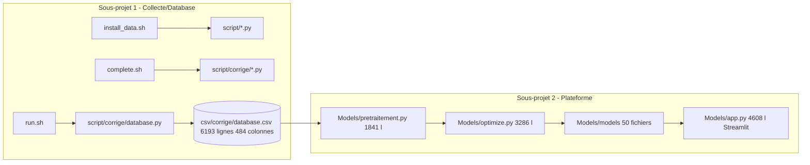
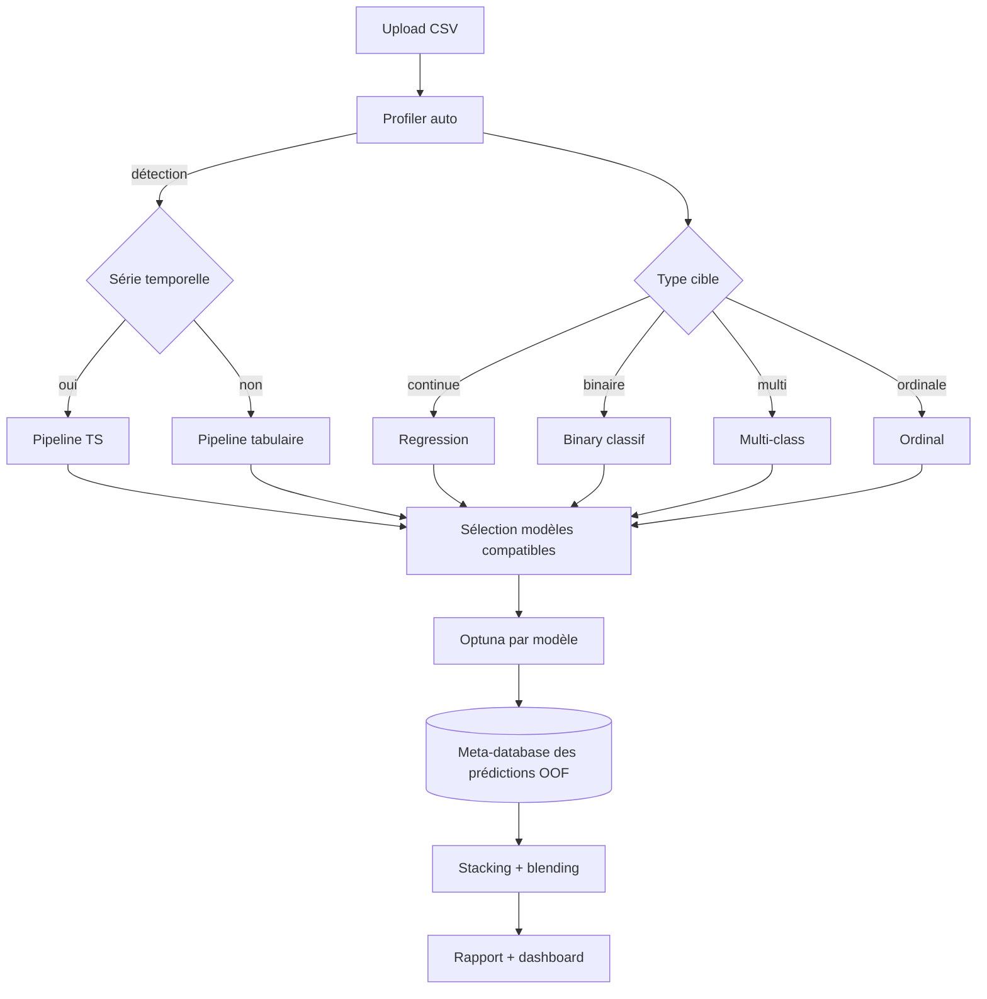

# Audit Refonte Mais — Plan stratégique

## 1. État des lieux factuel



Données brutes : marché CBOT (corn/wheat/soy/oats/oil/gas/USD), indicateurs techniques, FRED macro, WASDE, QuickStats, Production par état US, Météo 20 états. ~24 ans de daily, 484 colonnes.

Modèles : 50+ scripts dans [Models/models/](Models/models/) couvrant baselines (AR1, EMA, naive, seasonal), classiques (ARIMA/SARIMAX, ETS, Theta, TBATS, VAR/VECM, GARCH, UCM, Markov-switching, BOCPD), ML (RF, XGB, LGBM, CatBoost, ElasticNet, Ridge/Lasso, KNN, SVR, GAM, GP, NGBoost, Quantile RF/XGB), DL (LSTM, TCN, NBEATS, NHiTS, TFT, PatchTST, DLinear, TimesNet, TSMixer, Informer, DeepAR, TIDE), structures (Schwartz-Smith, Nelson-Siegel, HAR-RV), et meta (stacking, ensemble_weighted) — dont une partie est `NotImplementedError`.

---

## 2. Critique sévère mais constructive

### 2.1 Problèmes BLOQUANTS (à régler avant tout)

- **La cible du `config.yaml` est cassée** : [Models/config.yaml](Models/config.yaml) ligne 12 contient `target_col: is_last_lightning_cloud_ground`. C'est un copier-coller d'un autre projet. Tu as dû tourner des optimisations sur une mauvaise cible sans t'en rendre compte. Impact : tous les résultats antérieurs sont à jeter.
- **Le `database.csv` a des colonnes "fantômes"** : positions 132 à 141 dans l'en-tête sont `5.98`, `175.1`, `0.6321...`, `3.732...`. Ce sont des **valeurs numériques utilisées comme noms de colonnes** — bug de chargement (probablement un CSV sans header lu en mode header dans [script/corrige/database.py](script/corrige/database.py)). Ces colonnes empoisonnent toute analyse aval.
- **Doublons de colonnes** : `corn_ret_1d.1`, `corn_logret_1d.1`, `corn_vol_real_20.1` etc. — collisions de merge non gérées (cf. lignes 72-81 de [script/corrige/database.py](script/corrige/database.py) qui se contente du suffixe pandas par défaut).
- **Stacking non implémenté** : [Models/models/stacking_reg.py](Models/models/stacking_reg.py) ligne 64 fait `raise NotImplementedError`. Or c'est exactement la "meta-database" que tu décris vouloir. Idem pour `theory_only` (cf. [Models/EXPLICATION_SELECTION_VARIABLES.md](Models/EXPLICATION_SELECTION_VARIABLES.md) ligne 105).
- **Couverture météo incohérente** : 6 fichiers dans [csv/meteo_etats/](csv/meteo_etats/) font 214 KB (Kansas, NC, ND, PA, TN, TX) contre ~650 KB pour les autres → ~3x moins de données. Conséquence : les anomalies z-score sont calculées sur des historiques de longueurs très différentes selon l'état, ce qui biaise les comparaisons inter-états.

### 2.2 Problèmes structurels d'ingénierie

- **Monolithes** : `app.py` (4608 lignes), `optimize.py` (3286), `pretraitement.py` (1841). Aucun module ne devrait dépasser 800 lignes. Conséquences : impossible à tester unitairement, dur à reprendre, copier-coller multipliés.
- **4 scripts shell qui se chevauchent** : [install_data.sh](install_data.sh), [complete.sh](complete.sh), [run.sh](run.sh), [analyse.sh](analyse.sh) recréent tous le venv et installent les mêmes deps. Aucun DAG. Aucune idempotence garantie. Un `Makefile` ou `Snakefile` ferait le travail en 50 lignes.
- **CSV partout, jamais Parquet** : 27 MB de CSV pour `database.csv`, lecture lente et types perdus à chaque chargement. Parquet aurait fait ~5 MB et 10x plus rapide.
- **Pas de `requirements.txt` figé** : à la racine, le run.sh installe à la volée. Reproductibilité = zéro.
- **Mélange français/anglais** dans les noms (`corrige`, `meteo_etats`, `pretraitement.py` vs `optimize.py`, `wf_core.py`). Choisir une langue.
- **Aucun test** : 0 fichier `test_*.py`. Sur 12 000 lignes Python, c'est risqué.
- **`venv/` dans le projet** sans `.gitignore` clair. Le repo doit être propre.

### 2.3 Problèmes méthodologiques (les plus importants)

- **Anti-leakage déclaratif, jamais vérifié** : la doc Excel mentionne "shift(+1)" partout, mais aucun test automatique ne vérifie qu'une feature à la date `t` n'utilise pas d'info `>= t`. Sur 484 colonnes c'est intenable à la main.
- **Météo non pondérée par production** : Iowa = ~18 % de la production US, Tennessee = <0.5 %. Les variables `wx_*_anom_z` sont traitées à pied d'égalité, alors qu'un agrégat **belt-weighted** (pondéré par area_planted ou production) serait infiniment plus prédictif et 20x moins de colonnes.
- **Pas de notion de fréquence** : daily (marché) + weekly (export sales, crop progress, EIA éthanol) + monthly (WASDE) + quarterly (Grain Stocks) sont mélangés sans règle d'aggrégation/forward-fill explicite par fréquence.
- **`merge_asof tolerance=3D`** appliqué partout (cf. doc Excel `Historique`) est dangereux pour les variables mensuelles : une donnée WASDE de fin de mois M est utilisée pour des prix de M+30j sans flag.
- **Walk-forward `yearly_rolling`** : un retrain par an est trop espacé pour J+5/10. Les régimes (sécheresse, choc Ukraine, COVID) se déclarent en semaines.
- **Cible mal définie** : tu cherches J+5/10/20/30 mais le `config.yaml` n'a qu'`horizons: [10]`. Les modèles produisent du `corn_ret_5d` mais c'est une feature passée, pas une cible future. Il faut **explicitement** créer `y_logret_h{5,10,20,30} = log(P_{t+h}) - log(P_t)`.
- **Métrique d'évaluation orientée trading** (`Sharpe`, `InformationRatio`, `MaxDrawdown`) alors que l'objectif est un **conseil agriculteur**. Un agriculteur veut savoir "le prix sera-t-il dans le top 30 % ou le bottom 30 % à J+20 ?" — ça appelle des métriques de **classification ordinale calibrée**, pas du Sharpe.
- **Pas d'incertitude** : aucune sortie d'intervalle de confiance/quantile cohérent (sauf `quantile_regression.py` et `xgboost_quantile.py` mais non orchestrés). Conseiller un agriculteur sans IC = irresponsable.

---

## 3. Architecture cible proposée

Arborescence cible (à valider, aucun fichier déplacé pour l'instant) :

```
mais/
  data/
    raw/                  # téléchargements bruts (jamais modifiés)
      market/  weather/  fred/  wasde/  quickstats/  cot/  eia/  fas/  ndmc/
    interim/              # nettoyage intermédiaire (parquet)
    processed/
      features.parquet    # ex-database.csv, partitionné par année
      targets.parquet     # y_logret_h{5,10,20,30} + y_class_h*
    metadata/
      data_dictionary.parquet  # ex-Mais Cbot.xlsx, machine-readable
      anti_leakage_audit.parquet
  src/mais/
    collect/              # 1 module = 1 source (eia, fas, ndmc, cot, ...)
    clean/                # validations + dédup + freq harmonisation
    features/             # market.py, weather_belt.py, fundamentals.py, surprise.py, cot.py, ethanol.py, world.py
    targets.py            # construction explicite de y_h{5,10,20,30}
    leakage/              # tests automatiques d'anti-fuite
    models/               # adaptateurs pour les 50 modèles existants (signature unique)
      base.py             # ABC ModelAdapter
      registry.yaml       # qui est implémenté / quel type / quelles deps
    walkforward/          # core extrait de wf_core.py
    optimize/             # extrait d'optimize.py, en sous-modules <800 lignes
    meta/                 # vraie meta-database + stacking + blending
    decision/             # NEW : couche "indicateur agriculteur" (cf. section 5)
    api/                  # FastAPI : 1 endpoint /predict, /explain, /advice
    ui/                   # Streamlit, app.py éclaté en pages
  tests/
  notebooks/              # exploration uniquement
  pipelines/
    Snakefile             # ou Makefile : DAG complet collect -> clean -> features -> train
  config/
    sources.yaml          # toutes les URL/credentials/fréquences
    features.yaml         # définit chaque feature (formule, fréquence, lag, source)
    models.yaml           # ex-Models/config.yaml nettoyé
    decision.yaml         # seuils de l'indicateur agriculteur
  docs/
    ARCHITECTURE.md  DATA_DICTIONARY.md  ANTI_LEAKAGE.md  AGRO_INDICATOR.md
  pyproject.toml          # remplace requirements.txt épars
```

Pourquoi cette structure :
- **`src/mais/` package installable** (`pip install -e .`) : fini les `import` qui cassent quand on change de dossier.
- **`config/*.yaml` séparés par responsabilité** au lieu d'un mega-config.yaml.
- **`data/raw/` immuable** : on retélécharge jamais sur `interim/processed`.
- **`features.yaml` déclaratif** : chaque feature a une fiche (formule, source, fréquence, lag, anti-leakage) générable depuis le code, vérifiable automatiquement. Remplace `Mais Cbot.xlsx`.

---

## 4. Phase 1 — Variables : ce que tu proposes + ce que tu manques

Tes 10 catégories sont excellentes. Voici la critique et les ajouts.

### 4.1 Validation de tes propositions (avec priorisation)

- **Éthanol (EIA)** — d'accord, **TOP 1**. Source : EIA Weekly Petroleum Status Report (séries `WGFRPUS2`, `WGTSTUS1`). Note : ajouter aussi `ddgs_price` (drêches, co-produit éthanol) qui drive le crush margin.
- **Exports réels (USDA FAS Export Sales)** — d'accord, mais ATTENTION : la donnée sort le jeudi 8h30 ET pour la semaine se terminant le jeudi précédent → lag effectif de 7 jours, à modéliser explicitement.
- **Monde hors US** — d'accord. Sources : CONAB (Brésil safrinha), MAGyP (Argentine), APK-Inform / UkrAgroConsult (Ukraine), MARS-JRC (UE). Ajouter `parana_rainfall` et `mato_grosso_rainfall` (safrinha = 75 % du maïs brésilien).
- **Crop Progress** — d'accord, NASS QuickStats API. Note : `good_excellent_pct` est connu pour avoir une faible prédictivité brute mais une **forte prédictivité différenciée** (l'écart vs 5 ans).
- **Drought Monitor** — d'accord. NDMC publie `corn_area_d*` directement sur drought.gov, pas besoin de recalculer. Ajouter aussi `argentina_drought_index` et `brazil_drought_index` (hors US).
- **Coûts production** — d'accord, mais ces variables bougent peu et ont surtout un effet **sur les surfaces plantées N+1** (Prospective Plantings de mars), pas sur le prix court terme. À garder pour expliquer la planted area, pas le prix daily.
- **FX** — d'accord. Critique : `dxy` est déjà partiellement capturé par `usd_index_close`. Le vrai apport c'est `usd_brl` (prix Brésil en USD), `usd_ars`, `usd_uah`.
- **Structure de courbe** — d'accord, gros manque actuel. Ajouter le **basis** (prix cash terminal vs futures) qui est le signal n°1 utilisé par les agriculteurs réels.
- **CFTC COT** — d'accord. Disclaimer : publié vendredi 15h30 ET pour le mardi précédent (lag 3 jours). Source : `commitments.cftc.gov`.
- **Surprise** — d'accord, **c'est le signal le plus prédictif court terme**. Pour le consensus analystes, sources : Reuters/Bloomberg payantes — alternative gratuite : médiane des prévisions Allendale, Reuters poll (scrapable depuis Successful Farming).

### 4.2 Variables CRITIQUES que tu n'as pas listées

- **DTN/Pro Farmer Crop Tour** (août) : impact massif sur les prix.
- **Argentine Bolsa de Cereales** condition reports hebdo.
- **Freight rates Mississippi-NOLA** (USDA AMS) : un coup de freight peut shifter le basis de 30 c/bu.
- **Panama Canal restrictions** + **NOLA export inspections** (USDA FGIS hebdo).
- **Renewable Fuel Standard (RVO)** : décisions EPA → demande éthanol structurelle.
- **GLOBHE / Sentinel-2 NDVI** corn belt : NDVI moyen pondéré par area planted = leading indicator de yield à 30-60 j.
- **Soil moisture (SMAP NASA)** : meilleur que la pluie cumulée pour stress hydrique.
- **El Niño / La Niña ONI index** : driver dominant de la safrinha brésilienne.
- **Variables de calendrier USDA** (binaires) : `is_wasde_day`, `is_grain_stocks_day`, `is_acreage_day`, `days_to_next_wasde`. Le prix se comporte différemment ces jours-là.
- **Volatilité implicite options maïs (CME)** : `corn_vol_index` — meilleur que la volatilité réalisée pour anticiper.
- **Spread inter-marchés** : `corn_brazil_spread`, `corn_ukraine_fob_spread`.

### 4.3 Recommandations sur le **comment** plus que le quoi

- **Tout calculer en 4 fréquences** : daily, weekly, monthly, quarterly. Ne jamais forward-fill du monthly en daily sans flag `_is_stale_d` qui compte les jours depuis la dernière vraie observation.
- **Surprise = signal #1** : pour CHAQUE variable fondamentale, créer 3 versions : `x`, `x_consensus`, `x_surprise = x - x_consensus`. À défaut de consensus : `x - x.shift(1)`, `x - x.rolling(5y).mean()`, `x - x_trend_expected`.
- **Belt-weighted** : remplacer `wx_iowa_*`, `wx_kansas_*`... par `wx_belt_tavg_anom_z`, `wx_belt_prcp_anom_z` pondérés par `area_planted`. Garder le détail par état uniquement pour les top 5.
- **Lag explicite** : chaque feature a une colonne associée `_lag_days` qui dit "cette info était disponible publiquement avec X jours de retard". Permet l'audit anti-leakage automatique.

---

## 5. Phase 2 — Indicateur agriculteur (le vrai produit)

C'est la partie où ton projet peut devenir utile, pas juste académique. Mes recommandations :

### 5.1 Reformuler la cible

Un agriculteur ne veut pas un `corn_ret_5d` régressé. Il veut savoir :

- **Prix à J+H sera-t-il dans quel décile historique ?** (classification ordinale).
- **Probabilité que le prix monte de >5 % d'ici J+H** (classification binaire calibrée).
- **Intervalle 80 % du prix à J+H** (régression quantile : q10, q50, q90).
- **Régime de marché actuel** (rallying / range / breaking down) via Markov-switching ou BOCPD.

Ces 4 sorties doivent être livrées simultanément.

### 5.2 Couche `decision/`

Au-dessus des prédictions, ajouter un module qui transforme les sorties modèles en **règle de décision** paramétrable :

```
si q90(J+20) - q10(J+20) > seuil_incertitude  -> "attendre" (incertitude trop forte)
si proba(P_{t+H} > P_t * 1.05) > 0.6           -> "stocker"
si proba(P_{t+H} < P_t * 0.97) > 0.6           -> "vendre maintenant"
sinon                                            -> "vendre par tiers"
```

Avec **backtest agronomique** : sur 20 ans, qu'aurait gagné un agriculteur de Iowa (avec basis local typique, coût stockage $0.04/bu/mois, contraintes de cash-flow) en suivant la règle ? Comparer à : tout vendre à la récolte, vendre 1/12 par mois, suivre la moyenne mobile.

### 5.3 Calibration et explicabilité

- **Isotonic regression** ou **Platt scaling** sur les sorties classification.
- **Conformal prediction** (déjà ébauché dans `Models/models/conformal_prediction.py`) pour des intervalles avec garantie de couverture marginale → l'implémenter pour de vrai.
- **SHAP local** pour chaque prédiction : "le prix monte parce que (1) drought_belt_d2 a augmenté de 15 pts, (2) export_sales_surprise positive, (3) ethanol_stocks au plus bas 5 ans". C'est ce qui convaincra un agriculteur, pas un R²=0.12.

---

## 6. Phase 3 — Plateforme générique "any CSV → 40 modèles"

### 6.1 Critique de l'existant

- L'objectif "n'importe quel CSV, séries temporelles ou pas, classes, bools" est **trop ambitieux pour la même pipeline**. Un AR1 sur des données IID n'a aucun sens. Les TFT sur du tabulaire sans temps sont absurdes. Il faut un **routeur de pipeline** par type de problème détecté.
- L'UI Streamlit de 4608 lignes est ingérable. Il faut séparer **ingestion** / **profilage** / **config** / **run** / **résultats**.

### 6.2 Architecture cible plateforme



Concrètement :
- Une **ModelRegistry** (`src/mais/models/registry.yaml`) qui dit pour chaque modèle : `task_types: [regression, binary, ordinal]`, `requires: [time_index, panel, exogenous]`, `min_samples: 200`, `max_features: 10000`.
- Le profiler choisit automatiquement les modèles compatibles → fini les 40 modèles qui plantent silencieusement.
- La **meta-database** est une vraie table : `(date, modèle, horizon, fold, prédiction, vérité, params, métriques)` en parquet. Le stacking n'est plus un stub, c'est un `LightGBM(meta_features)` entraîné dessus.

### 6.3 Pipeline unifié

Remplacer les 4 `.sh` par un `Snakefile` ou `prefect` qui orchestre :

```
collect -> validate -> clean -> harmonize_freq -> features -> targets ->
anti_leakage_audit -> split -> train_each_model -> meta_table -> stack -> evaluate -> publish
```

Avec cache par étape (pas de re-télécharger 24 ans à chaque run), versioning des données (`dvc` ou `lakeFS`) et logging structuré (`structlog`).

---

## 7. Roadmap proposée (3 phases, ~6-10 semaines de travail solo)

```mermaid
gantt
  title Roadmap Refonte
  dateFormat X
  axisFormat %s
  section Phase 0 Hygiène
  Fixer cible config.yaml + colonnes fantômes :a1, 0, 3
  pyproject.toml + .gitignore + requirements figés :a2, after a1, 2
  Tests anti-leakage automatiques :a3, after a2, 5
  section Phase 1 Variables
  Restructurer data raw interim processed parquet :b1, after a3, 3
  Collecte EIA ethanol + FAS exports + COT :b2, after b1, 5
  Crop Progress + Drought + Monde Brésil Argentine :b3, after b2, 7
  Surprise WASDE + GIS + calendrier USDA :b4, after b3, 5
  Belt weighted météo + NDVI Sentinel :b5, after b4, 5
  section Phase 2 Indicateur
  Cibles y h5 h10 h20 h30 reg quantile binaire ordinale :c1, after b5, 4
  Conformal prediction implémenté :c2, after c1, 4
  Module decision avec règles paramétrables :c3, after c2, 4
  Backtest agronomique vs heuristiques :c4, after c3, 4
  section Phase 3 Plateforme
  Casser app.py optimize.py en modules :d1, after c4, 7
  ModelRegistry et profiler auto :d2, after d1, 5
  Stacking réel sur meta-database :d3, after d2, 5
  Snakefile pipeline unifié :d4, after d3, 4
```



### Phase 0 — Hygiène (priorité absolue, ~1 semaine)
1. Corriger `target_col` dans [Models/config.yaml](Models/config.yaml).
2. Reproduire et fixer le bug des colonnes "5.98", "175.1" dans [csv/corrige/database.csv](csv/corrige/database.csv) (probable lecture d'un CSV sans header).
3. Dédoublonner les `corn_*_1d.1`.
4. Mettre en place `pyproject.toml`, `.gitignore`, freeze des versions.
5. Écrire **5 tests anti-leakage** automatiques sur l'existant pour avoir une baseline.

### Phase 1 — Variables (~3-4 semaines)
Dans l'ordre d'impact attendu :
1. Cible propre `y_logret_h{5,10,20,30}` + classes ordinales.
2. Surprise WASDE/GIS/Acreage.
3. Belt-weighted météo + Drought Monitor + NDVI.
4. EIA éthanol + crush margin.
5. CFTC COT.
6. Crop Progress + condition vs 5y.
7. Monde : Brésil safrinha + Argentine + Ukraine + FX BRL/ARS/UAH.
8. Structure courbe + basis.

### Phase 2 — Indicateur agriculteur (~2 semaines)
1. Quantile regression calibrée + conformal prediction.
2. Markov-switching pour le régime.
3. Module `decision/` avec règles paramétrables.
4. Backtest agronomique réaliste (basis Iowa/Illinois, coûts stockage, on-farm vs commercial).
5. Dashboard Streamlit "Conseil agriculteur" : 1 page, 4 chiffres clés.

### Phase 3 — Plateforme générique (~2-3 semaines)
1. Découper [Models/app.py](Models/app.py), [Models/optimize.py](Models/optimize.py), [Models/pretraitement.py](Models/pretraitement.py) en modules <800 lignes.
2. ModelRegistry + profiler auto.
3. Implémenter pour de vrai [Models/models/stacking_reg.py](Models/models/stacking_reg.py) sur la meta-database.
4. Snakefile/Makefile pipeline unifié remplaçant [run.sh](run.sh) + [complete.sh](complete.sh) + [analyse.sh](analyse.sh) + [install_data.sh](install_data.sh).
5. Tests de bout en bout sur 3 datasets jouets (TS régression, TS classification, tabulaire).

---

## 8. Décisions à prendre par toi avant de coder

Je n'avance sur la Phase 0 qu'après que tu aies tranché ces 4 points :

1. **Langue du code** : tout en anglais (recommandé : facilite open-source/portfolio) ou bilingue ?
2. **Format de stockage** : Parquet (recommandé) ou rester CSV ?
3. **Orchestration** : Snakemake (data-science friendly) vs Prefect (plus moderne) vs simple Makefile (minimal) ?
4. **Périmètre du `git mv`** : on garde l'historique git en déplaçant les fichiers, ou on repart d'un repo propre `mais-v2/` à côté ?

Une fois ces 4 réponses obtenues, je peux commencer la Phase 0 (hygiène) qui est la plus urgente — sans elle, toute optimisation Phase 1+ est invalide.
